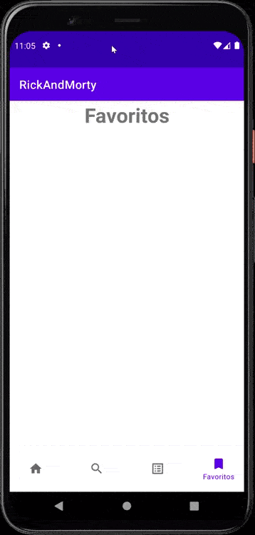

# MODULO 4 | Desarrollo de Aplicaciones Móviles Android Kotlin | Ignacio Cavallo

<https://github.com/cavigna/modulo_desarrollo_de_aplicaciones_moviles_android_kotlin>

## Clase 102 | 23-11 | Evaluación del Módulo

Luego de un milenio de clases, finalmente llegamos a la instancia del módulo final

> Realizar una aplicación Android Kotlin de Noticias. Esta aplicación debe contar con un buscador que nos permita presentar distintas noticias relacionadas a la búsqueda realizada, además agregar un botón que permita compartir las noticias. Las noticias se deben mostrar con una imagen que tendrá asociada una url que nos debe llevar a cada noticia. Se recomienda agregar las dependencias necesarias para hacer las peticiones, agregar librerías ya sea para imágenes (Picasso) o para ejecutar acciones en segundo plano (Anko). Finalmente debe compilar y empaquetar el proyecto.

A su vez, tambien existe esta información en la página:

> Debe ser capaz de conectarse a un servicio REST y consumir datos.
● Debe mostrar un listado de información obtenida desde el servicio Rest
● Debe utilizar alguna técnica de caching (Persistencia local)
● Debe permitir modificar o almacenar los favoritos de ese listado.
● El usuario podrá ver un listado de los favoritos seleccionados obtenidos desde la persistencia local
● Usar MVVM + Retrofit + ROOM
● Apis sugeridas: https://rickandmortyapi.com/, http://www.omdbapi.com/

Por lo que decidí hacer lo siguiente:

### **Hacer las dos apps, con el objetivo de aplicar todo lo aprendido durante del curso.** *ñoñaso*
Ambas utilizarán el patron de diseño MVVM, como también uso de persistencia de datos. Ambas se valdran de una fuente remota de datos, la almacenarán en una db para luego ser observadas por la vista.

NewsApp         |  Rick and Morty App
:-------------------------:|:-------------------------:
|  
[News App](https://github.com/cavigna/RickAndMortyApp) |[Rick and Morty](https://github.com/cavigna/RickAndMortyApp)


 #### Para el código completo dejo los links a los repos:

### [News App](https://github.com/cavigna/RickAndMortyApp)  
### [Rick and Morty](https://github.com/cavigna/RickAndMortyApp)


### MVVM

<image src= "./images/mvvm.png" height="500px" alignment= "center">

Como se puede observar, la vista requerirá información la cual será solicitará al *View Model* y este a su vez llamará al repositorio.

# News App - (<https://newsapi.org/>)

Para que vayamos de forma ordenanda, seguiré el flujo de trabajo con el cual dearrollé la App. Siempre el punto de partida es el modelo, luego su interfaz, el objeto que implementa la interfaz, el repositorio, el viewmodel y eventualmente la vista. A su vez implementé algunos test insturmentales que los dejaré al final de este apartado.


### 1 - Modelo

Si una llamada típica a la API, nos devuelve lo siguiente:

```json
{
"status": "ok",
"totalResults": 9543,
"articles": [
    {
    "source": {
    "id": "business-insider",
    "name": "Business Insider"
    },
        "author": "mfox@businessinsider.com (Matthew Fox)",
        "title": "US stocks end mixed as yields jump after Biden picks Jerome Powell to lead the Fed for a 2nd term",
        "description": "\"The nomination of Powell and Brainard suggest continuity at the Fed given that they have generally been in alignment,\" Bank of America said.",
        "url": "https://markets.businessinsider.com/news/stocks/stock-market-news-today-biden-picks-jerome-powell-fed-chairman-2021-11",
        "urlToImage": "https://images2.markets.businessinsider.com/619c011963e3f300187545ce?format=jpeg",
        "publishedAt": "2021-11-22T21:16:11Z",
        "content": "Federal Reserve Chair Jerome Powell listens as President Joe Biden nominates him for a second four-year term.Kevin Lamarque/Reuters\r\n<ul><li>US stocks ended mixed on Monday after President Biden nomi… [+3016 chars]"
    },
    {...}
```

Entonces tendriamos los siguientes modelos:

```kotlin

data class NewsResponse(
    @SerializedName("articles")
    var articles: List<Article> = listOf(),
    @SerializedName("status")
    var status: String = "",
    @SerializedName("results")
    var totalResults: Int = 0
)

data class Source(
    @SerializedName("id")
    var id: Any = Any(),
    @SerializedName("name")
    var name: String = ""
)

data class Article(
    @SerializedName("author")
    var author: String = "",
    @SerializedName("content")
    var content: String = "",
    @SerializedName("description")
    var description: String = "",
    @SerializedName("publishedAt")
    var publishedAt: String = "",
    @SerializedName("source")
    var source: Source = Source(),
    @SerializedName("title")
    var title: String = "",
    @SerializedName("url")
    var url: String = "",
    @SerializedName("urlToImage")
    var urlToImage: String = ""
)
```

Como vemos, cada uno de los atributos de cada clase, se corresponde con las entradas de Json.

```kotlin
"status": "ok", //==>    @SerializedName("results") var totalResults: Int = 0
"totalResults": 9543, //==>   var totalResults: Int = 0
"articles":  //==> var articles: List<Article> = listOf()
```

## 2 - API Service

Uttilizando RetroFit, creamos una interfaz que realizará las llamadas a la API. Nuestro objetivo es replicar la siguiente llamada
**``https://newsapi.org/v2/top-headlines?country=ar&apiKey=...&pageSize=50``**

1. Usamos la anotación ``@Get`` para avisar a que es una llamada de tipo get.
2. Como argumento, completamos la dirección luego de la urlBase
3. Usamos las anotiaciones ``@Query`` para completar las diferentes secciones de el llamado:
   a. country
   b. apiKey
   c. pageSize
4. Es una función de tipo suspend, debido a que se ejecutará con una corrutina, ya que es de tipo asíncrono.

```kotlin
interface ApiService {

    companion object {
        val API_KEY = BuildConfig.API_KEY
    }
    
    @GET("top-headlines")
    suspend fun traerUltimasNoticiasAr(
        @Query(value = "country") country: String = "ar",
        @Query(value = "apiKey") apiKey: String = API_KEY,
        @Query(value = "pageSize") pageSize: Int = 50
    ): NewsResponse

    @GET("everything")
    suspend fun buscarNoticia(
        @Query(value = "q", encoded = true) q: String,
        @Query("sortBy") sortBy: String="publishedAt",
        @Query(value = "apiKey") apiKey: String = API_KEY,
        @Query(value = "pageSize") pageSize: Int = 50
    ):NewsResponse
    
    }
```

## 3 - Retrofit Client

Será el encargado de implenetar la interfaz antes mencionadas.

```kotlin
            private val retrofitNewsClient  by lazy {
            Retrofit.Builder()
                .baseUrl("https://newsapi.org/v2/")
                .addConverterFactory(GsonConverterFactory.create())
                .build()
                .create(ApiService::class.java)

        }
```

## 4 - Repositorio

Crearemos un repositorio con un argumento  el servicio definido en el punto 2. Más adelante le agregaremos otro argumento más, el ``Dao``. Por ahora quedaría así:

```kotlin
class Repositorio(private val api: ApiService) {

    suspend fun traerUltimasNoticiasAr() = api.traerUltimasNoticiasAr()
}

```

## 5 - ViewModel

El View Model tendrá como parámetro el repositorio y heredará de ViewModel().

```kotlin
class NewsViewModel(private val repositorio: Repositorio) : ViewModel() {

    val listadoApi: LiveData<NewsResponse> = LiveData<NewsResponse>() 

    init{
        traerUltimasNoticias() 
    }
    fun traerUltimasNoticias() {
        viewModelScope.launch(IO) {
        try {
            listadoAPi.postValue(repositorio.traerUltimasNoticasAr())
        }catch (e: NetworkErrorException){

        }


        }
    }

}
class NewsModelFactory(private val repositorio: Repositorio) : ViewModelProvider.Factory {
    override fun <T : ViewModel> create(modelClass: Class<T>): T {
        return NewsViewModel(repositorio) as T
    }
}
```

Como podemos observar, la función *NO* es de tipo suspend, ya que en esta instancia efectivamente ejecutamos la corrutina asociado al Scope del viewModel.  Cuando se ejecute, guaradará los valores en una constante de tipo LiveData.
A su vez, creamos un Modelfactory el cual nos permitirá crear el viewmodel con un patron de delegación que veremos a continuación.

## Intermedio - Injección de Dependencias

Google sugiere que, para reducir el *boiler plate*, se puede crear una injección de dependencias manual. Esto lo hacemos creando una clase que herede de Application y a su vez que lo declaremos en el manifest.

```Kotlin
class NewsApp: Application() {

        private val retrofitNewsClient  by lazy {
            Retrofit.Builder()
                .baseUrl("https://newsapi.org/v2/")
                .addConverterFactory(GsonConverterFactory.create())
                .build()
                .create(ApiService::class.java)

        }

 

    val repositorio by lazy { Repositorio(retrofitNewsClient) }
}
```

```xml
    <application
        android:name=".application.NewsApp".../>
        
```

## 6 - View (Fragmento)

Ya en el fragmento, podemos implementar con el binding la respuesta de la api. Teóricamente sería así:

```kotlin
class HomeFragment : Fragment() {
    private lateinit var binding: FragmentHomeBinding
    private lateinit var application: Application

    private val viewModel by activityViewModels<NewsViewModel> {
        NewsModelFactory((application as NewsApp).repositorio)
    }
    override fun onCreate(savedInstanceState: Bundle?) {
        super.onCreate(savedInstanceState)
        application = requireActivity().application
    }
    override fun onCreateView(
        inflater: LayoutInflater, container: ViewGroup?,
        savedInstanceState: Bundle?
    ): View? {
        binding = FragmentHomeBinding.inflate(layoutInflater, container, false)
        val recyclerView = binding.recyclerView
        val adapter = NewsListAdapter(this)
        recyclerView.adapter = adapter
        recyclerView.layoutManager = LinearLayoutManager(requireContext())
        
        viewModel.listadoApi.observe(viewLifecycleOwner,{
            adapter.submitList(it)
        })
        return binding.root

    }
}

```

Digo teoricamente, por que esta no es la implementación final. Ya que nos falta la base de datos. Veamos el diseño:

## Intermedio - Diseño de la App

Pensé que como mejor alternativa, era llamar a la API, buscar la información que requiero y guardarla en mi base de datos local. El viewModel solo observará la info de la db con expeción a las búsquedas, ya que me pareció innecesario almacenar esos datos. Así, en términos pedagogicos puedo interactuar con la db en su mayoría, pero una vista sigue haciendo llamadas externas. Resumiendo, voy a crear dos tablas, una será de las útimas noticias mientras que la otra almacenará las favoritas.

## Persistencia de Datos

La logica es muy similar a lo antes expuesto, haremos un modelo, una interfaz, una base de datos los cuales se aglutinaran en el repositorio.


## 7 - Modelo

Modelaremos dos clases que representen tanto las últimas noticias como aquellas guardadas en favorito

```kotlin
@Entity(tableName = "news_table")
data class NewsEntity(

    val fuente: String = "",
    val titulo:String = "",
    val descripcion:String = "",
    val url:String = "",
    val imagenUrl:String = "",
    val contenido:String = "",

    @PrimaryKey
    val fecha : Date  = (Calendar.getInstance().timeInMillis as Date)

)

@Entity(tableName = "news_fav_table")
data class NewsFavEntity(

    val fuente: String = "",
    val titulo:String = "",
    val descripcion:String = "",
    val url:String = "",
    val imagenUrl:String = "",
    val contenido:String = "",

    @PrimaryKey
    val fecha : Date = (Calendar.getInstance().timeInMillis as Date)
)
```

Notesé las anotaciones ``@Entity`` y ``@PrimaryKey``. La primera nos generará una entidad que será interpetada como una taba y la segunda hace refereinca a la llave primaria de una tabla de SQL.

## 8 - DAO

 Los objetos de acceso a datos o DAO, sonel componente principal de Room, ya que cada DAO incluye métodos que ofrecen acceso abstracta a la base de datos(Léase: Insert, Delete, Update). Aquellas operaciones que son potencialmente bloqueadora de hilos, son ejecutadas con suspend. Las que devuelven un LiveData no, ya que estas son concientes del ciclo de vida.

 ```kotlin
 @Dao
interface NewsDao {
    @Insert(onConflict = OnConflictStrategy.REPLACE)
    suspend fun agregarListadoNews(listadoNews: List<NewsEntity>)

    @Query("SELECT * FROM news_table WHERE imagenUrl != '' AND contenido !='' ORDER BY fecha DESC")
    fun listarUltimasNoticias(): Flow<List<NewsEntity>>

    @Insert(onConflict = OnConflictStrategy.REPLACE)
    suspend fun agregarFavNews(favNews: NewsFavEntity)

    @Delete
    suspend fun borrarFavorito(favNews: NewsFavEntity)

    @Query("SELECT * FROM news_fav_table")
    fun listarFavoritos(): Flow<List<NewsFavEntity>>
    }
```

## 9 - Base De Datos

La explicación más detallada está [aquí](https://github.com/cavigna/Android_101/tree/main/Room_DataBase), pero observemos que asociamos dos entidades a nuestra base de datos, la de favoritos y ultimas noticias. También vemos como utilizamos conversores de tipo, ya que room no acepta datos complejos y necesitamso converswores especiales para ello, en nuestro caso *Date*

```kotlin
@TypeConverters(Converters::class)
@Database(entities = [NewsEntity::class, NewsFavEntity::class], version = 1, exportSchema = false)
abstract class BaseDeDatos : RoomDatabase() {
    abstract fun dao() : NewsDao
    
    companion object {
        @Volatile
        private var INSTANCE: BaseDeDatos? = null
        fun getDataBase(context: Context): BaseDeDatos {
            return INSTANCE ?: synchronized(this) {
                val instance = Room.databaseBuilder(
                    context.applicationContext,
                    BaseDeDatos::class.java,
                    "news_db"
                ).fallbackToDestructiveMigration()
                    .build()
                INSTANCE = instance

                instance
            }
        }
    }
}
```

## 10 - Repositorio

Como dijimos antes, nuestro repoa hora tendrá otro argumento, el dao:

```kotlin
class Repositorio(private val api: ApiService, private val dao: NewsDao) {

    suspend fun traerUltimasNoticiasAr() = api.traerUltimasNoticiasAr()
    suspend fun agregarUltimasNoticasDB() {

        val listadoAgregarDB = mutableListOf<NewsEntity>()
        val listadoApi = traerUltimasNoticiasAr().articles
        
        // Este es un conversor del Modelo de la Api, a la entidad
        listadoApi.forEach { art ->
            listadoAgregarDB.add(
                NewsEntity(
                    fuente = art.source.name ?: "",
                    titulo = art.title ?: "",
                    descripcion = art.description ?: "",
                    url = art.url ?: "",
                    imagenUrl = art.urlToImage ?: "",
                    contenido = art.content ?: "",
                    fecha = formateameLaFecha(art.publishedAt)!!
                )
            )}

        dao.agregarListadoNews(listadoAgregarDB)
    }

    fun listarNoticiasDB() = dao.listarUltimasNoticias()
    suspend fun agregarFavorito(favEntity: NewsFavEntity) = dao.agregarFavNews(favEntity)
    suspend fun eliminarFavorito(favEntity: NewsFavEntity) = dao.borrarFavorito(favEntity)
    fun listarFavorito() = dao.listarFavoritos()
    suspend fun buscarNoticia(query: String) = api.buscarNoticia(query)
}
```

## 11 - ViewModel

El View Model quedaría así

```kotlin
class NewsViewModel(private val repositorio: Repositorio) : ViewModel() {

    val listadoNewsDB = repositorio.listarNoticiasDB().asLiveData()

    var noticiaSelecionada = MutableLiveData<NewsEntity>()
    var noticiaFavSelecionada = MutableLiveData<NewsFavEntity>()

    var noticiaBuscadaDetalles = MutableLiveData<Article>()

    val listadoFavoritos = repositorio.listarFavorito().asLiveData()

    init {
       agregarListadoDB() // Al iniciar, se agregará la respuesta de la api a la DB
    }


    private fun agregarListadoDB() {
        viewModelScope.launch(IO) {
        try {
            repositorio.agregarUltimasNoticasDB()
        }catch (e: NetworkErrorException){ }
        }
    }


    fun agregarFavorito(favorito: NewsFavEntity){
        viewModelScope.launch(IO) {
            repositorio.agregarFavorito(favorito)
        }
    }

    fun eliminarFavorito(favorito: NewsFavEntity){
        viewModelScope.launch(IO) {
            repositorio.eliminarFavorito(favorito)
        }
    }

    val resultadoBusqueda = MutableLiveData<NewsResponse>()

    fun buscarNoticia(query: String){
        viewModelScope.launch(IO){
            resultadoBusqueda.postValue(repositorio.buscarNoticia(query))
        }

    }

}
```

## 12 - View (Fragment)

```kotlin
class DetailsFavFragment : Fragment() {

    private lateinit var binding: FragmentDetailsFavBinding
    private lateinit var application: Application

    private val viewModel by activityViewModels<NewsViewModel> {
        NewsModelFactory((application as NewsApp).repositorio)
    }

    override fun onCreate(savedInstanceState: Bundle?) {
        super.onCreate(savedInstanceState)
        application = requireActivity().application
    }

    override fun onCreateView(
        inflater: LayoutInflater, container: ViewGroup?,
        savedInstanceState: Bundle?
    ): View? {
        binding = FragmentDetailsFavBinding.inflate(layoutInflater, container, false)

        viewModel.noticiaFavSelecionada.observe(viewLifecycleOwner, { news ->
            with(binding) {
                imageView2.load(news.imagenUrl)
                textViewTitulo.text = news.titulo.substringBefore("-")
                textViewDesc.text = news.descripcion
                textViewContenido.text = news.contenido.substringBefore("[")
            }
        })

        binding.imageviewFavorito.setOnClickListener {
            agregarFavorito()
            Toast.makeText(requireContext(), "Noticia agregada", Toast.LENGTH_SHORT).show()

        }
        
        val fb = binding.floatingActionButton
        fb.setOnClickListener {
            val intent = Intent(Intent.ACTION_SEND)
            intent.type = "*/*"

            intent.putExtra("url", viewModel.noticiaSelecionada.value?.url)

            if (intent.resolveActivity(activity?.packageManager!!)!=null){
                startActivity(intent)
            }
        }

        binding.buttonLink.setOnClickListener {
            val url = viewModel.noticiaSelecionada.value?.url
            openWebPage(url!!)
        }
        return binding.root

    }

    private fun agregarFavorito(){
        val newsDetail = viewModel.noticiaSelecionada.value
        val newsFav = NewsFavEntity(
            fuente = newsDetail?.fuente!!,
            titulo = newsDetail.titulo,
            descripcion = newsDetail.descripcion ,
            url = newsDetail.url,
            imagenUrl = newsDetail.imagenUrl,
            contenido = newsDetail.contenido,
            fecha = newsDetail.fecha,
        )

        viewModel.agregarFavorito(newsFav)
    }
    private fun openWebPage(url: String) {
        val webpage: Uri = Uri.parse(url)
        val intent = Intent(Intent.ACTION_VIEW, webpage)
        if (intent.resolveActivity(activity?.packageManager!!) == null) {
            startActivity(intent)
        }
    }
}

```
Dejo algunas imágenes de la Base de Datos

<image src= "./images/3.jpg">
<image src= "./images/4.jpg">

## 13 - Testing

### Remote Testing

```kotlin

@ExperimentalCoroutinesApi
@RunWith(AndroidJUnit4::class)
@MediumTest
class RemoteTest {

    @get: Rule

    var instantTaskExecutorRule = InstantTaskExecutorRule()

    private val mockWebServer = MockWebServer()
    private val MOCK_WEBSERVER_PORT = 8000
    private lateinit var repositorioTest: Repositorio
    private lateinit var repositorio: Repositorio

    private lateinit var database: BaseDeDatos
    private lateinit var dao: NewsDao

    private val dispatcher = TestCoroutineDispatcher()
    private val testScope = TestCoroutineScope(dispatcher)

    @Before
    fun setup() {
        mockWebServer.start(MOCK_WEBSERVER_PORT)
        val context = ApplicationProvider.getApplicationContext<Context>()
        database = Room.inMemoryDatabaseBuilder(context, BaseDeDatos::class.java)
            .allowMainThreadQueries()
            .build()

        dao = database.dao()

        val retrofitClientTest by lazy {
            Retrofit.Builder()
                .baseUrl(mockWebServer.url("/"))
                .addConverterFactory(GsonConverterFactory.create())
                .build()
                .create(ApiService::class.java)
        }


        val retrofitClient by lazy {
            Retrofit.Builder()
                .baseUrl("https://newsapi.org/v2/")
                .addConverterFactory(GsonConverterFactory.create())
                .build()
                .create(ApiService::class.java)

        }


        repositorioTest = Repositorio(retrofitClientTest, dao)
        repositorio = Repositorio(retrofitClient, dao)
    }

    @After
    fun teardown(){
        mockWebServer.shutdown()
        database.close()
    }

    @Test
    fun noticiaComparador(){
        val articuloOriginal = Article(
            "Hernán Cappiello",
            "La Corte Suprema de Justicia dejó firme una condena a 3 años y seis meses de prisión contra el exfuncionario Germán Kammerath por negociaciones incompatibles con la función pública cuando fue intende… [+3581 chars]",
            "Es por negociaciones incompatibles con la función pública en 2000; hubo disidencias de los jueces Rosenkrantz y Maqueda porque dicen que se violó el plazo razonable para el proceso",
            "2021-10-28T19:52:30Z",
            Source("la-nacion","La Nacion"),
            "La Corte dejó firme una sentencia a 3 años y 6 meses contra el ex funcionario Germán Kammerath",
            "https://www.lanacion.com.ar/politica/la-corte-dejo-firme-una-sentencia-a-3-anos-y-6-meses-contra-el-ex-funcionario-german-kammerath-nid28102021/",
            "https://resizer.glanacion.com/resizer/uWI-9SusBymhJT-RI2p5q_7WNLE=/768x0/filters:quality(80)/cloudfront-us-east-1.images.arcpublishing.com/lanacionar/CSTROHTH5JHIXO56DLK4ZAW4MM.jpg"
        )

        mockWebServer.apply{
            enqueue(
                MockResponse()
                    .setResponseCode(200)
                    .setBody(
                        FileReader.readStringFromFile("mock_response.json")
                    )
            )
        }

        testScope.launch {
            val articulo = repositorioTest.buscarNoticia("germán kammerath").articles[0]
            assertThat(articuloOriginal).isEqualTo(articulo)
        }

    }

    @Test
    fun buscarNoticiaTest(){
        mockWebServer.apply {
            MockResponse()
                .setBody(
                    FileReader.readStringFromFile("mock_response.json")
                )
        }

        testScope.launch {
            val noticiaApi = repositorio.buscarNoticia("germán kammerath").articles
            val noticiaMock = repositorioTest.buscarNoticia("germán kammerath").articles

            assertThat(noticiaApi).isEqualTo(noticiaMock)
        }
    }
}
```
<image src= "./images/5.jpg">

### Local Testing
```kotlin
@ExperimentalCoroutinesApi
@RunWith(AndroidJUnit4::class)
@SmallTest
class LocalDBTest {

    @get:Rule
    var instantTaskExecutorRule = InstantTaskExecutorRule()

    private lateinit var database: BaseDeDatos
    private  lateinit var dao : NewsDao

    private val noticiaFavorita = NewsFavEntity(
        "la nación",
        "Algun título escandaloso",
        "aca va un contenido bien amarrillista",
        fecha = Calendar.getInstance().time
    )

    private val noticiaABorrar = NewsFavEntity(
        "la nación",
        "Algun título escandaloso a borrar",
        "aca va un contenido bien amarrillista, pero como es tan amarillo, lo borramos",
        fecha = Calendar.getInstance().time
    )


    private val noticia = NewsEntity(
        "la nación",
        "Algun título escandaloso",
        "aca va un contenido bien amarrillista",
        fecha = Calendar.getInstance().time,
        imagenUrl = "http algo",
        contenido = "Contenido muy noticioso"
    )

    private val noticiaDos = NewsEntity(
        "la nación",
        "Algun título escandaloso a borrar",
        "aca va un contenido bien amarrillista, pero como es tan amarillo, lo borramos",
        fecha = Calendar.getInstance().time,
        imagenUrl = "http algo",
        contenido = "Contenido muy noticioso"
    )
    @Before
    fun setup(){
        val context = ApplicationProvider.getApplicationContext<Context>()

        database = Room.inMemoryDatabaseBuilder(context, BaseDeDatos::class.java)
            .allowMainThreadQueries()
            .build()

        dao =  database.dao()
    }

    @After
    fun teardown(){
        database.close()
    }

    @Test
    fun agergarListadoUltimasNoticiasTest() {
        val listadoNoticiasApi = listOf(noticia, noticiaDos)
        runBlockingTest {


            dao.agregarListadoNews(listadoNoticiasApi)

            val listadoNoticiasLD = dao.listarUltimasNoticias().asLiveData().getOrAwaitValue()

            assertThat(listadoNoticiasLD).contains(noticia)
            assertThat(listadoNoticiasLD).contains(noticiaDos)

        }
    }
    @Test
    fun agergarFavoritoTest() {

        runBlockingTest {


            dao.agregarFavNews(noticiaFavorita)

            val listadoNoticiasTest = dao.listarFavoritos().asLiveData().getOrAwaitValue()

            assertThat(listadoNoticiasTest).contains(noticiaFavorita)
        }
    }

    @Test
    fun eliminarFavoritoTest() = runBlockingTest {

        dao.agregarFavNews(noticiaFavorita)
        dao.borrarFavorito(noticiaABorrar)

        val listadoNoticias = dao.listarFavoritos().asLiveData().getOrAwaitValue()

        assertThat(listadoNoticias).doesNotContain(noticiaABorrar)
    }
}
```
<image src= "./images/6.jpg">

# [Rick And Morty App]() - (<https://rickandmortyapi.com/>)
A esta altura supongo que no es necesario volver a explicar la lógica de los modelos, la db, etc. Pero si me gustaría resaltar lo siguiente:

#### 1 - Consumo de datos Locales

*Esta aplicación consume de una API rest para almacenar TODOS los personajes enla base de datos local. Una vez que esa llamada remota finaliza, la lógica de la app se enmarca dentro de la base de datos.*

```kotlin


class RickViewModel(private val repositorio: Repositorio) : ViewModel() {
    val listadoPersonajesDB = repositorio.listadoPersonajeDB().asLiveData()
    val listadoPersonajesDB = repositorio.listadoPersonajeDB().asLiveData()
    init {       
        agregarTodosPersonajesDB()
    }   

    fun agregarTodosPersonajesDB() {

        viewModelScope.launch(IO) {
            withContext(Main) {
                for (i in 1..42) {
                    val listadoApi = repositorio.listadoPersonajesTodosApi(pagina = i).resultados
                    repositorio.agregarListadoPersonaDB(mapearAPItoDB(listadoApi))
                }
            }
        }
    }
}
/*
Si lo implementara con Retro fit
    var personajeRandomApi = MutableLiveData<Resultado>()
    fun buscarpersonajeRandom() {
        viewModelScope.launch(IO) {
            val personaje = repositorio.personajeRandomApi()
            personajeRandomApi.postValue(personaje)

        }
    }
 */

```

#### 1 - Busqueda De Personaje en tiempo real desde la DB
La vista de búsqueda solo se da en la base de datos, a traves de LiveData con una query que busca por nombre en tiempo real
```kotlin
@Dao
interface RickDao {
    //.....//
    @Query("SELECT * FROM personajes_tabla WHERE name LIKE :search")
    fun buscarPersonaje(search: String?): Flow<List<Personaje>>
}

class Repositorio(private val api: ApiService, private val dao: RickDao) {
//...//
    fun buscarPersonaje(query:String) = dao.buscarPersonaje(query)
}


class RickViewModel(private val repositorio: Repositorio) : ViewModel() {

    fun buscarPersonaje(query:String) = repositorio.buscarPersonaje(query).asLiveData()
}

class SearchFragment : Fragment() {

/*....*/
        val searchView = binding.searchView2

        searchView.setOnQueryTextListener(object : SearchView.OnQueryTextListener,
            android.widget.SearchView.OnQueryTextListener {
            override fun onQueryTextSubmit(query: String?): Boolean {
                if (query!= null){
                    searchDB(query)
                }
                return true
            }

            override fun onQueryTextChange(newText: String?): Boolean {
                if (newText!= null){
                    searchDB(newText)
                }
                return true
            }

        })

        /* ...*/

    private fun searchDB(query:String){
    val searchQuery = "%$query%"

    viewModel.buscarPersonaje(searchQuery).observe(viewLifecycleOwner, {
        adapter.submitList(it)
    })

    }
}
```
#### Personaje Random desde la DB
Implementación de un método que permite buscar en un personaje de la base de datos de forma aleatoria al iniciar la applicación:

```kotlin
fun funPerRandomDB() = repositorio.personajeRandomDB(id = (1..826).random()).asLiveData()

```
   
<image src= "./images/7.jpg">
<image src= "./images/8.jpg">
