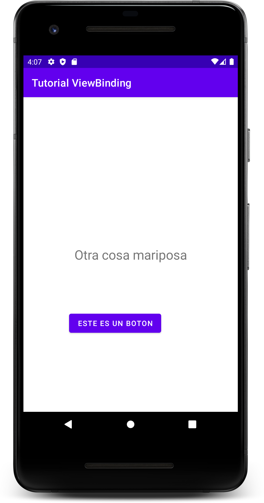

# MODULO 4 | Desarrollo de Aplicaciones Móviles Android Kotlin | Ignacio Cavallo


https://github.com/cavigna/modulo_desarrollo_de_aplicaciones_moviles_android_kotlin

## Clase 56 | 20-07

Empezamos con Kotlin.
Si bien el profesor dice que nos enseña las nuevas practicas como los sintéticos, la verdad que eso ya no se usa. De hecho en un mes mas ni siquiera se podrán usar, es por ello que preferí aprender por mi cuenta, la forma correcta de llamar a los elementos de la UI. esta es ViewBinding

#

```kotlin

package com.example.tutorialviewbinding

import androidx.appcompat.app.AppCompatActivity
import android.os.Bundle
import android.widget.TextView
import com.example.tutorialviewbinding.databinding.ActivityMainBinding


//import kotlinx.android.synthetic.main.activity_main.* ===> ERROR! DEPECREATED.

/*
*       **** TODO THE OLD WAY ****

class MainActivity : AppCompatActivity() {
    override fun onCreate(savedInstanceState: Bundle?) {
        super.onCreate(savedInstanceState)
        setContentView(R.layout.activity_main)
        
        val textUno = findViewById<TextView>(R.id.textUno)
        textUno.setText("Dos")

    }
}
*/

class MainActivity : AppCompatActivity() {


    override fun onCreate(savedInstanceState: Bundle?) {
        super.onCreate(savedInstanceState)
        val binding = ActivityMainBinding.inflate(layoutInflater) //==> Generamos un Binding
        setContentView(binding.root) // ===> Definimos el contenido en el root de binding

        binding.textUno.setText("Esto es View Binding")

        binding.textUno.text = "Otra cosa mariposa" // ===> Esta es la forma Correcta

        binding.buttonB.setText("este es un boton")

    }
}

```

# RESULTADO

