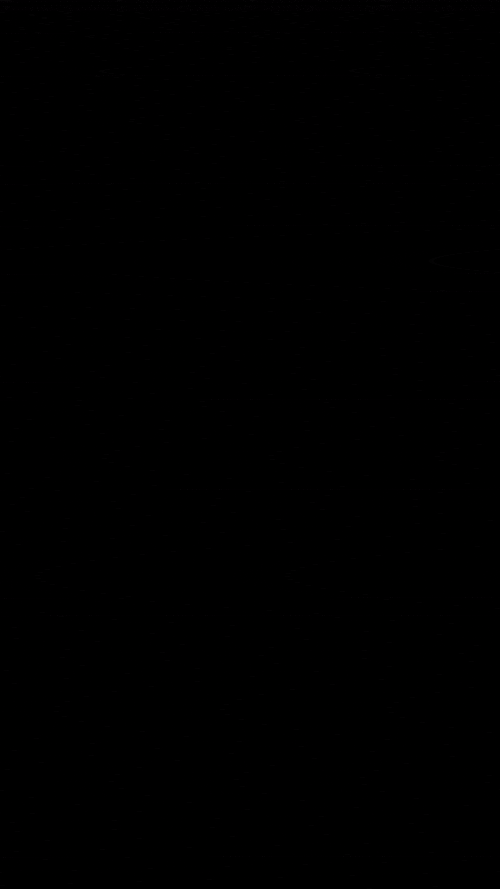

# MODULO 4 | Desarrollo de Aplicaciones Móviles Android Kotlin | Ignacio Cavallo


https://github.com/cavigna/modulo_desarrollo_de_aplicaciones_moviles_android_kotlin

## Clase 57 | 21-07

Como hoy se dispuso hacer exactamente lo mismo que en el módulo de java, decidí empezar a utilizar Jetpack Compose. Esta librería no tiene versión estable, y sigue estando en Beta por lo cual tuve que instalar una versión especial de Android Studio llamada **Fox Artic** y hacerle unos tuneos al gradle, ya que me daba error de Build. En definitiva, seguí un tutorial con el objetivo de hacer una **Barra de progreso Circular *Animada***

# RESULTADO




# CODIGO

```kotlin
package com.example.composetutorial


import android.os.Bundle
import androidx.activity.ComponentActivity
import androidx.activity.compose.setContent
import androidx.compose.animation.core.animateFloatAsState
import androidx.compose.animation.core.tween
import androidx.compose.foundation.Canvas
import androidx.compose.foundation.layout.Box
import androidx.compose.foundation.layout.fillMaxSize
import androidx.compose.foundation.layout.size
import androidx.compose.material.Text
import androidx.compose.runtime.*
import androidx.compose.ui.Alignment
import androidx.compose.ui.Modifier
import androidx.compose.ui.graphics.Color
import androidx.compose.ui.graphics.StrokeCap
import androidx.compose.ui.graphics.drawscope.Stroke
import androidx.compose.ui.text.font.FontWeight
import androidx.compose.ui.unit.Dp
import androidx.compose.ui.unit.TextUnit
import androidx.compose.ui.unit.dp
import androidx.compose.ui.unit.sp

class MainActivity : ComponentActivity() {
    override fun onCreate(savedInstanceState: Bundle?) {
        super.onCreate(savedInstanceState)
        setContent {
            Box(
                contentAlignment = Alignment.Center,
                modifier = Modifier.fillMaxSize()
            ) {
                CircularProgressBar(porcentaje = 0.8f, number = 100)
            }

        }

    }
}

@Composable
fun CircularProgressBar(
    porcentaje: Float,
    number: Int,
    fontSize: TextUnit = 28.sp,
    radius: Dp = 50.dp,
    color: Color = Color.Green,
    strokeWidth: Dp = 8.dp,
    animationDuration: Int = 10000,
    animationDelay: Int = 10,
) {
    var animationPlayed by remember {
        mutableStateOf(false)
    }

    val currentPercentage = animateFloatAsState(
        targetValue = if (animationPlayed) porcentaje else 0f,
        animationSpec = tween(
            durationMillis = animationDuration,
            delayMillis = animationDelay
        )
    )
    LaunchedEffect(key1 = true) {
        animationPlayed = true
    }
    Box(
        contentAlignment = Alignment.Center,
        modifier = Modifier.size(radius * 2f)
    ) {
        Canvas(modifier = Modifier.size(radius * 2f)) {
            drawArc(
                color = color,
                -90f,
                360 * currentPercentage.value,
                useCenter = false,
                style = Stroke(strokeWidth.toPx(), cap = StrokeCap.Round)
            )
        }
        Text(
            text = (currentPercentage.value * number).toInt().toString(),
            color = Color.Black,
            fontSize = fontSize,
            fontWeight = FontWeight.Bold
        )
    }

}


```


