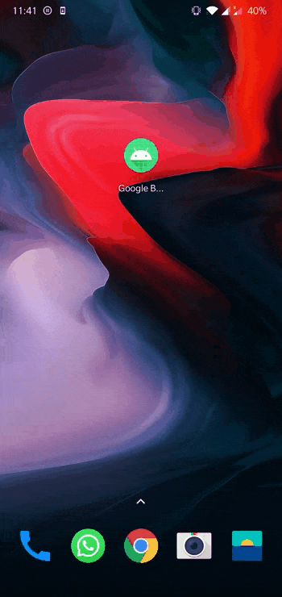

# MODULO 4 | Desarrollo de Aplicaciones Móviles Android Kotlin | Ignacio Cavallo


https://github.com/cavigna/modulo_desarrollo_de_aplicaciones_moviles_android_kotlin

## Clase 58 | 22-07

Siento que las clases han dejado de ser productivas, hoy literalmente, estuvimos cuatro horas en silencio. No se impartió nada, salvo una directiva de aprender de forma autodidacta temas que podrian haber sido explicados en clase en unos 15 minutos. Es por ello que sigo con mi lineamiento de realizar tutoriales para aprender todos los temas relevantes de este módulo considerando que por como vamos, no nos ensañaran mucho. Hoy hice en Jetpack compose un boton animado de registro. Por cierto, el gif ha sido grabado desde mi celular

# RESULTADO




# CODIGO


## `MainActivity.kt`
```kotlin
package com.example.googlebuttoncompose

import android.os.Bundle
import android.util.Log
import androidx.activity.ComponentActivity
import androidx.activity.compose.setContent
import androidx.compose.foundation.layout.Arrangement
import androidx.compose.foundation.layout.Column
import androidx.compose.foundation.layout.fillMaxSize
import androidx.compose.material.ExperimentalMaterialApi
import androidx.compose.runtime.Composable
import androidx.compose.ui.Alignment
import androidx.compose.ui.Modifier
import androidx.compose.ui.tooling.preview.Preview
import com.example.googlebuttoncompose.ui.theme.GoogleButtonComposeTheme

class MainActivity : ComponentActivity() {
    @ExperimentalMaterialApi
    override fun onCreate(savedInstanceState: Bundle?) {
        super.onCreate(savedInstanceState)
        setContent {
            GoogleButtonComposeTheme {
                Column(
                    Modifier.fillMaxSize(),
                    verticalArrangement = Arrangement.Center,
                    horizontalAlignment = Alignment.CenterHorizontally
                ) {
                    GoogleButton(
                        text = "Registrate con Google",
                        loadingText = "Creando Cuenta...",
                        onClicked = {
                            Log.d("Google Button", "Clicked")
                        }
                    )
                }
            }
        }
    }
}


@ExperimentalMaterialApi
@Preview(showBackground = true)
@Composable
fun DefaultPreview() {
    GoogleButtonComposeTheme {
        Column {
            Column(
                Modifier.fillMaxSize(),
                verticalArrangement = Arrangement.Center,
                horizontalAlignment = Alignment.CenterHorizontally
            ) {
                GoogleButton(
                    text = "Registrate con Google",
                    loadingText = "Creando Cuenta...",
                    onClicked = {
                        Log.d("Google Button", "Clicked")
                    }
                )  }

            }
        }
        }
```

## `GoogleButton.kt`
```kotlin
package com.example.googlebuttoncompose

import androidx.compose.animation.animateContentSize
import androidx.compose.animation.core.LinearOutSlowInEasing
import androidx.compose.animation.core.tween
import androidx.compose.foundation.BorderStroke
import androidx.compose.foundation.layout.*
import androidx.compose.foundation.shape.CornerBasedShape
import androidx.compose.material.*
import androidx.compose.runtime.Composable
import androidx.compose.runtime.mutableStateOf
import androidx.compose.runtime.remember
import androidx.compose.ui.tooling.preview.Preview
import androidx.compose.runtime.*
import androidx.compose.ui.Alignment
import androidx.compose.ui.Modifier
import androidx.compose.ui.graphics.Color
import androidx.compose.ui.graphics.painter.Painter
import androidx.compose.ui.res.painterResource
import androidx.compose.ui.unit.dp
import com.example.googlebuttoncompose.ui.theme.Shapes

@ExperimentalMaterialApi
@Composable
fun GoogleButton(
    text: String = "Registrate con Google",
    loadingText: String = "Creando Cuenta ....",
    icon: Painter = painterResource(R.drawable.ic_google_logo),
    shape: CornerBasedShape = Shapes.medium,
    borderColor: Color = Color.LightGray,
    backgroundColor: Color = MaterialTheme.colors.surface,
    progressIndicatorColor: Color = MaterialTheme.colors.primary,
    onClicked: () -> Unit
) {
    var clicked by remember { mutableStateOf(false) }
    Surface(
        onClick = { clicked = !clicked },
        shape = shape,
        border = BorderStroke(width = 1.dp,color = borderColor),
        color = backgroundColor

    ) {
        Row(
            Modifier.padding( //Da padding en el Row
                start = 12.dp,
                end = 16.dp,
                top = 12.dp,
                bottom = 12.dp
            ).animateContentSize(
                animationSpec = tween(
                    durationMillis = 300,
                    easing = LinearOutSlowInEasing
                )
            ),
            verticalAlignment = Alignment.CenterVertically,
            horizontalArrangement = Arrangement.Center
        ) {
            Icon(
                painter = icon,
                contentDescription = "Google Button",
                tint = Color.Unspecified,

                )
            Spacer(Modifier.width(8.dp)) // ==> Separa el logo del Texto
            Text(text = if (clicked) loadingText else text)
            if (clicked) {
                CircularProgressIndicator(
                    Modifier
                        .height(16.dp)
                        .width(16.dp),
                    strokeWidth = 3.dp,
                    color = progressIndicatorColor
                )
                onClicked()
            }
        }

    }
}

@ExperimentalMaterialApi
@Composable
@Preview
private fun GoogleButtonPreview() {
    GoogleButton(
        text = "Registrate con Google",
        loadingText = "Creando Cuenta...",
        onClicked = {}
    )
}
```


