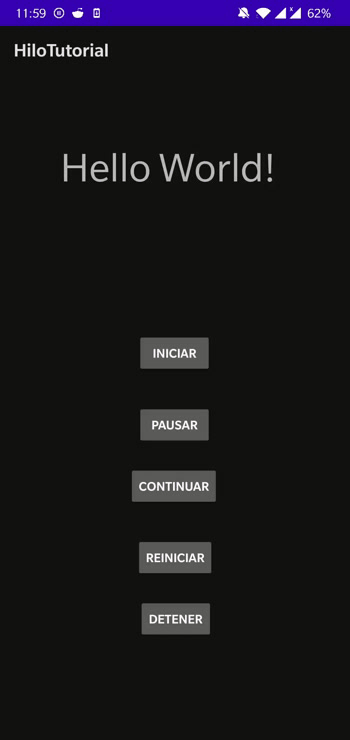

# MODULO 4 | Desarrollo de Aplicaciones Móviles Android Kotlin | Ignacio Cavallo


https://github.com/cavigna/modulo_desarrollo_de_aplicaciones_moviles_android_kotlin

## Clase 61 | 27-07

Ejercicio Propuesto por el Prof.
# RESULTADO




# CODIGO


## `MainActivity.kt`
```kotlin
package com.example.hilotutorial

import androidx.appcompat.app.AppCompatActivity
import android.os.Bundle
import com.example.hilotutorial.databinding.ActivityMainBinding

private lateinit var binding: ActivityMainBinding

class MainActivity : AppCompatActivity() {

    var contador = 0
    var estado = true
    var pausa = false

    override fun onCreate(savedInstanceState: Bundle?) {
        var hilo = Hilo(this)
        binding = ActivityMainBinding.inflate(layoutInflater)
        super.onCreate(savedInstanceState)
        setContentView(binding.root)

        binding.btniniciar.setOnClickListener {
            hilo.start()
        }
        binding.btnpausar.setOnClickListener {
            pausa = true
        }
        binding.btncontinuar.setOnClickListener {
            pausa = false
        }

        binding.btnreiniciar.setOnClickListener {
            contador = 0
        }

        binding.btndetener.setOnClickListener {
            if (hilo.isAlive) {
                estado = false
                return@setOnClickListener
            }
        }


    }

    class Hilo(activity: MainActivity) : Thread() {
        var act = activity

        override fun run() {
            super.run()

            while (act.estado) {
                while (act.pausa == true) {
                    sleep(100)
                }
                sleep(100)
                act.runOnUiThread {
                    binding.tvnumero.text ="Hilo: " + act.contador

                }
                act.contador++
            }
        }
    }
}


```


