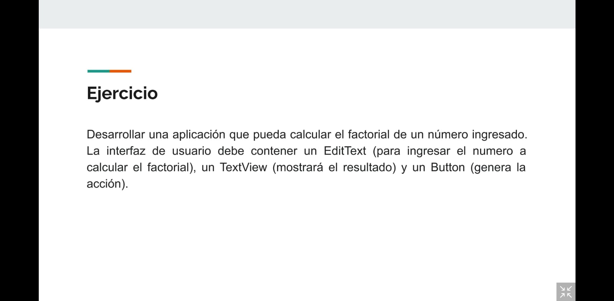
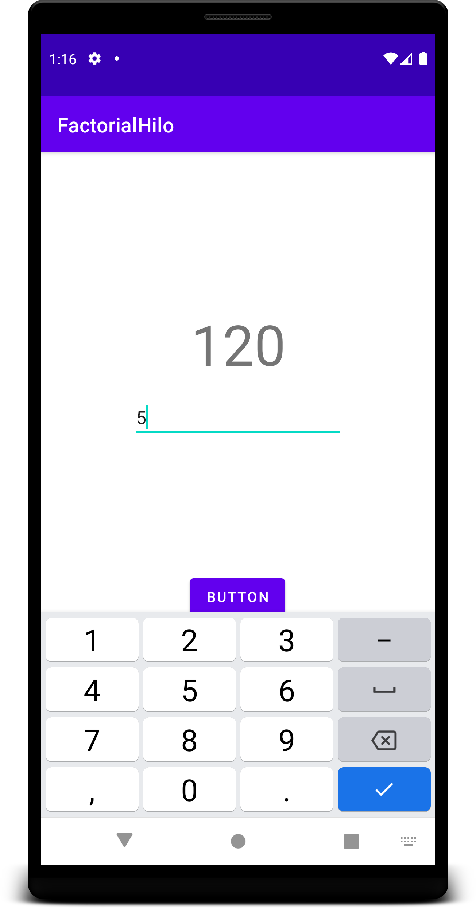

# MODULO 4 | Desarrollo de Aplicaciones Móviles Android Kotlin | Ignacio Cavallo


https://github.com/cavigna/modulo_desarrollo_de_aplicaciones_moviles_android_kotlin

## Clase 62 | 28-07

La clase de hoy viene repitiendo la misma lógica de las últimas semanas. EL profesor hace aparición a las 8:30 para saludar, dar alguna directiva y de ahí silencio total. Luego regresa a las 10 para avisarnos del break, y finalmente aparece a las 12:30 para despedirse. Literalmente habla o dice algo 10 minutos de 4 horas. Y ya nos quejamos con AIEP y no hubo ningún cambio. Esta es mi reflexión, ESTOY APRENDIENDO CON ALGUNOS COMPAÑEROS, POR NUESTRA CUENTA, ya que en clase se enseña POCO O NADA. Por mi parte, creo que deberiamos sentarnos a discutir sobre los el temario del curso. 

 Ejercicio Propuesto por el Prof.



# RESULTADO




# CODIGO


## `MainActivity.kt`
```kotlin
package com.example.factorialhilo

import androidx.appcompat.app.AppCompatActivity
import android.os.Bundle
import android.provider.Settings
import android.util.Log
import com.example.factorialhilo.databinding.ActivityMainBinding
import kotlinx.coroutines.Dispatchers
import kotlinx.coroutines.GlobalScope
import kotlinx.coroutines.launch

private lateinit var binding: ActivityMainBinding

class MainActivity : AppCompatActivity() {
    override fun onCreate(savedInstanceState: Bundle?) {
        super.onCreate(savedInstanceState)
        binding = ActivityMainBinding.inflate(layoutInflater)
        setContentView(binding.root)
       


        binding.button.setOnClickListener {
            GlobalScope.launch(Dispatchers.Main) {
                val numeroUsuario = binding.editTextNumber.text.toString()
                val numerodos = numeroUsuario.toInt()
                val resultado = factorial(numerodos).toString()
                binding.textviewResultado.text = resultado

            }
        }

    }


     suspend  fun factorial(n: Int): Int {
        Log.v("Tokio", "$n")
        return if( n==0) 1 else n * factorial(n - 1)
    }


}


```


