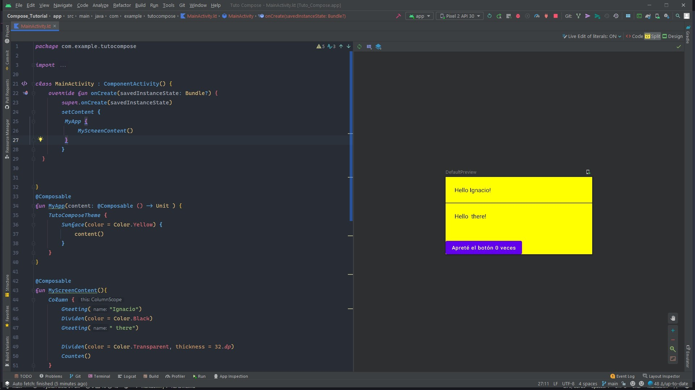

# MODULO 4 | Desarrollo de Aplicaciones Móviles Android Kotlin | Ignacio Cavallo


https://github.com/cavigna/modulo_desarrollo_de_aplicaciones_moviles_android_kotlin

## Clase 63 | 29-07

Para mi reflexión, básicamente voy a hacer lo mismo que se viene haciendo las ultimas clases, repetición de patrones que no aportan en nada. Por eso repito:
>La clase de hoy viene repitiendo la misma lógica de las últimas semanas. El profesor hace aparición a las 8:30 para saludar, dar alguna directiva y de ahí silencio total. Luego regresa a las 10 para avisarnos del break, y finalmente aparece a las 12:30 para despedirse. Literalmente habla o dice algo 10 minutos de 4 horas.  

Por lo mismo, decidí hacer un tutorial de Jetpack Compose,la nueva librería de Android. No voy a permitir que ninguna clase no aprenda algo, y si el profesor no lo hace, lo haré yo. 

### Pido disculpas si mis relfexiones son un poco negativas, el tema es que estamos muy frustrados, y por aquí es uno de los poco canales donde puedo expresar lo que siento.

 Hice un tutorial de Compose
# RESULTADO




# CODIGO


## `MainActivity.kt`
```kotlin

package com.example.tutocompose

import android.os.Bundle
import androidx.activity.ComponentActivity
import androidx.activity.compose.setContent
import androidx.compose.foundation.layout.Column
import androidx.compose.foundation.layout.padding
import androidx.compose.material.Button
import androidx.compose.material.Divider
import androidx.compose.material.Surface
import androidx.compose.material.Text
import androidx.compose.runtime.Composable
import androidx.compose.runtime.mutableStateOf
import androidx.compose.runtime.remember
import androidx.compose.ui.Modifier
import androidx.compose.ui.graphics.Color
import androidx.compose.ui.tooling.preview.Preview
import androidx.compose.ui.unit.dp
import com.example.tutocompose.ui.theme.TutoComposeTheme

class MainActivity : ComponentActivity() {
    override fun onCreate(savedInstanceState: Bundle?) {
        super.onCreate(savedInstanceState)
        setContent {
         MyApp {
             MyScreenContent()
         }
        }
  }


}
@Composable
fun MyApp(content: @Composable () -> Unit ) {
    TutoComposeTheme {
        Surface(color = Color.Yellow) {
            content()
        }
    }
}

@Composable
fun MyScreenContent(){
    Column {
        Greeting("Ignacio")
        Divider(color = Color.Black)
        Greeting(" there")

        Divider(color = Color.Transparent, thickness = 32.dp)
        Counter()
    }
}

@Composable
fun Counter(){
    val count = remember { mutableStateOf(0)}
    Button(onClick = { count.value++ }){
        Text("Apreté el botón ${count.value} veces")
    }
}

@Composable
fun Greeting(name: String) {
    Text(text = "Hello $name!", modifier = Modifier.padding(24.dp))

}

@Preview(showBackground = true)
@Composable
fun DefaultPreview() {
    MyApp {
        MyScreenContent()
    }
}

```


