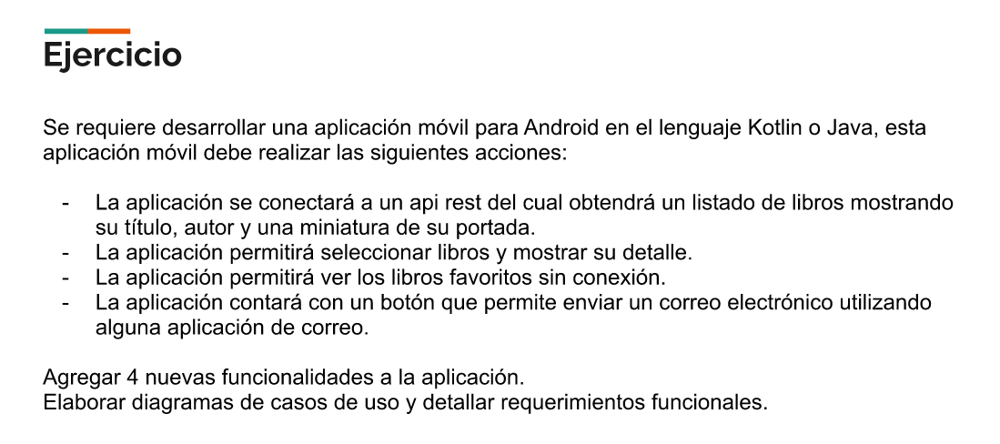

# MODULO 4 | Desarrollo de Aplicaciones Móviles Android Kotlin | Ignacio Cavallo


https://github.com/cavigna/modulo_desarrollo_de_aplicaciones_moviles_android_kotlin

## Clase 64 | 30-07

 Ejercicio Propuesto por el Prof.

 
# RESULTADO


# CODIGO


## `MainActivity.kt`
```kotlin
package com.example.booksv1

import androidx.appcompat.app.AppCompatActivity
import android.os.Bundle
import android.util.Log
import androidx.lifecycle.lifecycleScope
import com.example.booksv1.RetrofitInstance.retroService
import com.example.booksv1.databinding.ActivityMainBinding
import kotlinx.coroutines.launch

class MainActivity : AppCompatActivity() {
    private lateinit var binding: ActivityMainBinding
    override fun onCreate(savedInstanceState: Bundle?) {
        binding = ActivityMainBinding.inflate(layoutInflater)
        super.onCreate(savedInstanceState)
        setContentView(binding.root)


        lifecycleScope.launchWhenCreated {
            val response = retroService.searchByName()
            val data = response.body()!!

            if (response.isSuccessful){
                Log.v("Libros", response.body().toString())
                binding.tvprueba.text = data.items.get(0).volumeInfo.title

            }
        }
    }

    private fun getBookByName(){
        lifecycleScope.launch{

        }
    }
}


```


